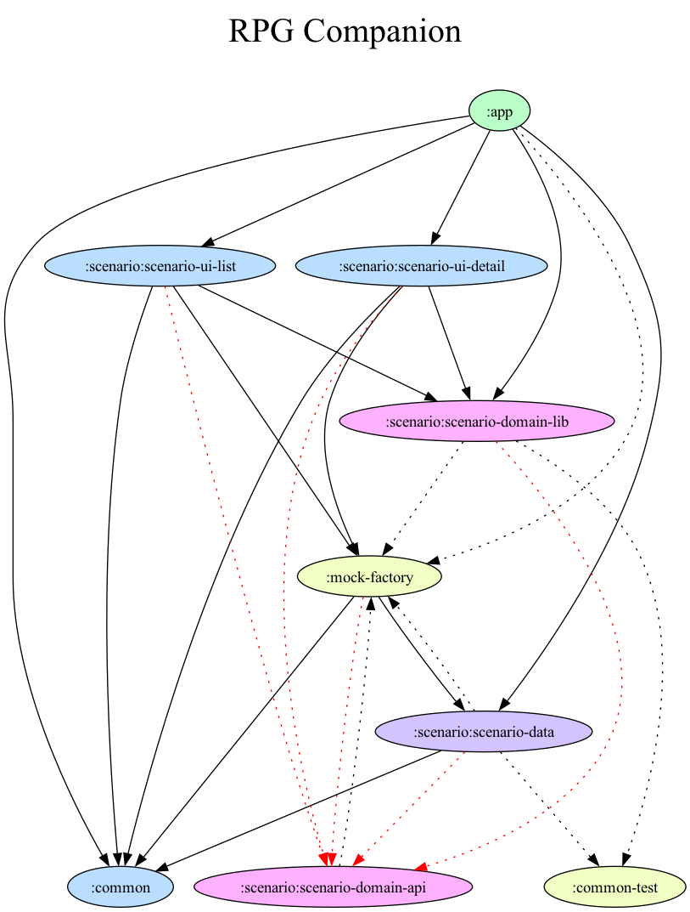

[](https://sonarcloud.io/summary/new_code?id=florentin-v_android-rpg-companion)

# Android RPG Companion

## Description

An Android application that aims to support GMs during their role-playing sessions.

The first feature consists in offering an original and intuitive navigation experience when reading
a scenario contained in a GDocs.

## Modules

The app has been modularized in order to respect clean architecture.



If the dependency graph change, please run the follow commands at the project root:

```shell
./gradlew :app:projectDependencyGraph
cp ./build/reports/dependency-graph/project.* ./documentation/dependency-graph/
```

### `app`

Contains the main elements like navigation, home page. This is also where we use all Koin modules.

### `common`

Contains all common stuff that can be used in all modules.
_For example: common UI elements (theme, color, topbar, etc.)_

### `common-test`

Contains all elements that can be reused in test classes.
_**For example** : the [BasicKoinTest](common-test/src/main/java/BasicKoinTest.kt) abstract
class._

### `scenario`

Contains all the elements relating to the notion of scenario (ui, data, domain, etc.).

#### `scenario-data` ([here](/scenario/scenario-data))

Contains all the element of the data layer :

* DTO
* Implementations of repositories
* Data sources
* Mappers **Source** &rarr; **DTO**
* Mappers **DTO** &rarr; **Model**
* Unit tests
* Koin module which inject all implementations of repositories, data sources and
  mappers ([ScenarioDataModule.kt](/scenario/scenario-data/src/main/java/com/fvanaldewereld/rpgcompanion/data/scenario/di/ScenarioDataModule.kt))

#### `scenario-domain-api` ([here](/scenario/scenario-domain-api))

Contains all the api elements of the domain layer :

* Models which be used in all modules
* Interfaces of repositories which be implemented in `scenario-data`

#### `scenario-domain-lib` ([here](/scenario/scenario-domain-lib))

Contains all the lib elements of the domain layer :

* Usecases
* Unit tests
* Koin module which inject all
  usecases ([ScenarioDomainModule.kt](/scenario/scenario-domain-lib/src/main/java/com/fvanaldewereld/rpgcompanion/lib/domain/scenario/di/ScenarioDomainModule.kt))

#### `scenario-detail-ui` ([here](/scenario/scenario-ui-detail))

Contains all the elements of the UI layer which concern the Scenario Detail Screen :

* Components
* ViewModels
* UiStates which describes the state of the screen
* Koin module which inject all
  ViewModels ([ScenarioUiDetailModule.kt](/scenario/scenario-ui-detail/src/main/java/com/fvanaldewereld/rpgcompanion/ui/scenario/detail/di/ScenarioUiDetailModule.kt))

#### `scenario-list-ui` ([here](/scenario/scenario-ui-list))

Contains all the elements of the UI layer which concern the Scenario List Screen :

* Components
* ViewModels
* UiStates which describes the state of the screen
* Koin module which inject all
  ViewModels ([ScenarioUiListModule.kt](/scenario/scenario-ui-list/src/main/java/com/fvanaldewereld/rpgcompanion/ui/scenario/list/di/ScenarioUiListModule.kt))
